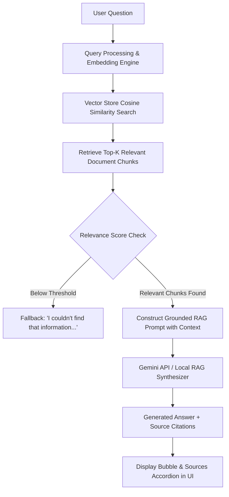

# Library RAG Bot Web Application

A professional, production-grade **Library RAG (Retrieval-Augmented Generation)** Chatbot Web Application built with Python FastAPI, an in-memory/persistent Cosine Similarity Vector Store, and a modern SaaS dark-themed responsive user interface.

The application allows users to ask natural language questions about library policies, opening hours, membership rules, digital resources, borrowing quotas, and late fines. Answers are generated **strictly based on relevant document chunks retrieved from the library knowledge base**, with interactive source citations.

---

## 🌟 Key Features

- **🤖 Interactive RAG Chatbot UI**:
  - Clean message bubbles (User & AI Assistant) with formatted markdown lists and bold text.
  - Interactive **"Sources Used (RAG)" Accordion** below AI answers showing document file names, section titles, match confidence percentages, and preview snippets.
  - Welcome hero card with clickable **Suggested Questions**.
  - Real-time typing/loading indicator and toast notifications.
  - Support for Enter key sending and Shift+Enter multi-line input.

- **📚 Document Ingestion & Chunking Pipeline**:
  - Native multi-format parser supporting **PDF**, **DOCX**, **TXT**, and **Markdown (.md)** files.
  - Recursive text splitter with configurable chunk size (~600 chars) and overlap (~100 chars).
  - Pre-populated rich sample knowledge base (`documents/sample_library_data/`).

- **⚡ Dual Embeddings & Vector Search Engine**:
  - Supports **Google Gemini API** (`text-embedding-004` and `gemini-2.5-flash` / `gemini-1.5-flash`).
  - Includes a **High-Precision Local RAG Grounded Generator & TF-IDF Vectorizer fallback** when no API key is provided, making the application **100% operational out-of-the-box**.

- **📊 Knowledge Base Dashboard**:
  - Live metric cards (Total Documents, Total Vector Chunks, Storage Engine, Sync Status).
  - Document Management Table with search filter, format badges, and chunk count.
  - Drag-and-drop file upload zone.
  - Re-Index button to re-scan and rebuild vectors on demand.
  - Chunk Inspector modal to inspect extracted vectors.

- **🔍 Standalone Vector Search Explorer**:
  - Interactive test interface to run semantic vector queries directly and inspect cosine similarity matches.

- **⚙️ Settings & Configuration**:
  - Dynamic API key entry (saved locally or sent to backend).
  - Sliders for Chunk Size, Chunk Overlap, and Top-K retrieval counts.
  - Dark / Light Mode theme toggle with local storage persistence.

---

## 🏗️ Architecture & RAG Workflow



---

## 📁 Project Structure

```
library-rag-bot/
├── backend/
│   ├── main.py                  # FastAPI application entry point, static mount, CORS
│   ├── config.py                # Environment configuration & default settings
│   ├── models/
│   │   └── schemas.py           # Pydantic schemas (ChatRequest, ChatResponse, DocumentInfo, etc.)
│   ├── rag/
│   │   ├── loader.py            # Text extraction for PDF, DOCX, TXT, MD
│   │   ├── text_splitter.py     # Recursive text chunking engine
│   │   ├── embeddings.py        # Dual embedding engine (Gemini API + Local TF-IDF)
│   │   ├── vector_store.py      # Cosine similarity vector index with persistence
│   │   └── pipeline.py          # RAG pipeline orchestration and generation
│   └── api/
│       └── routes.py            # REST API routes (/api/chat, /api/documents, /api/search, etc.)
├── documents/
│   └── sample_library_data/     # Pre-populated sample library documents
│       ├── library_rules.md
│       ├── membership_guide.md
│       ├── digital_resources.txt
│       ├── catalog_and_borrowing.docx
│       └── FAQ_and_services.pdf
├── vector_store/                # Persisted vector index cache (index_store.json, embeddings.npy)
├── frontend/
│   ├── index.html               # SaaS HTML interface layout
│   ├── style.css                # Custom CSS stylesheet (Dark mode, glassmorphism, responsive grid)
│   └── script.js                # Frontend logic, state management, API requests, toast alerts
├── .env.example                 # Environment variables template
├── .env                         # Local environment settings
├── .gitignore                   # Version control ignore rules
├── requirements.txt             # Python dependencies
└── README.md                    # Project documentation
```

---

## 🚀 Quickstart Guide

### 1. Prerequisites
- Python 3.10+
- `pip` package manager

### 2. Installation

Clone or extract the repository, then navigate to the root directory:

```bash
cd "RAG Bot"
```

Install Python dependencies:

```bash
pip install -r requirements.txt
```

### 3. Environment Setup (Optional)

The `.env` file contains settings for server port, chunk sizes, and API keys:

```env
GEMINI_API_KEY=your_gemini_api_key_here
HOST=127.0.0.1
PORT=8000
CHUNK_SIZE=600
CHUNK_OVERLAP=100
TOP_K_RESULTS=4
```

> **Note**: If `GEMINI_API_KEY` is left blank, the system automatically uses the Local Precision RAG Synthesizer engine. You can also configure the API key directly inside the Settings tab in the web UI.

---

## 💻 Running the Application

Start the FastAPI backend server:

```bash
python backend/main.py
```

Open your browser and navigate to:

👉 **`http://127.0.0.1:8000/`**

---

## 🔌 API Endpoints Reference

| Method | Endpoint | Description |
| :--- | :--- | :--- |
| `GET` | `/api/health` | System status, vector count, document count |
| `POST` | `/api/chat` | Execute RAG pipeline for user question |
| `GET` | `/api/documents` | List indexed documents with metadata & chunk counts |
| `POST` | `/api/documents/upload` | Upload a new document (.pdf, .docx, .txt, .md) and index it |
| `DELETE` | `/api/documents/{filename}` | Delete document file and purge its vector chunks |
| `POST` | `/api/documents/reindex` | Trigger full re-indexing of documents directory |
| `POST` | `/api/search` | Standalone semantic vector search against knowledge base |
| `GET` | `/api/settings` | Read current runtime configuration |
| `POST` | `/api/settings` | Update API key, chunk size, or top-K parameters |

---

## 🛡️ Security & Best Practices

- API keys are handled securely via `.env` and environment variables.
- Uploaded file types are strictly sanitized (.pdf, .docx, .txt, .md).
- Frontend never exposes raw API credentials.
- Answers are constrained to retrieved library documents to prevent hallucination.
